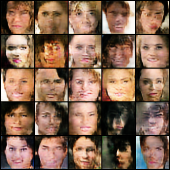
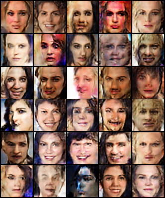

DCGAN and ACGAN models implemented in PyTorch.

Adapted from https://github.com/eriklindernoren/PyTorch-GAN/tree/master/implementations/dcgan and https://github.com/eriklindernoren/PyTorch-GAN/blob/master/implementations/acgan.

DCGAN results:

The ACGAN model was trained to disentangle the 'smiling' feature in the training set. This allows images to be generated of people smiling or not smiling. Results:

